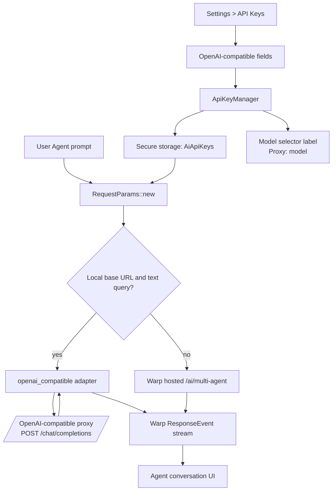
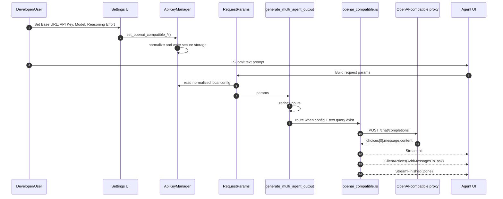

# Local OpenAI-Compatible Agent Endpoint

This document describes the local OpenAI-compatible endpoint support added for
Warp Agent. The goal is to let a local fork route simple Agent text prompts to a
proxy such as CLIProxyAPI without changing Warp's hosted multi-agent protocol or
the upstream BYO API-key entitlement logic.

## Goals

- Keep the patch easy to rebase on top of upstream Warp.
- Store local endpoint settings in the same secure local API-key storage path as
  existing provider keys.
- Add settings UI for a local OpenAI-compatible base URL, API key, model, and
  optional reasoning effort.
- Route simple text Agent requests to a local `/chat/completions` endpoint when
  a local base URL is configured.
- Surface proxy/model usage in the conversation metadata and model selector
  label so users can tell when local routing is active.
- Preserve the existing Warp-hosted multi-agent path when local config is absent
  or the input is not a simple user-query flow.

## Non-Goals

- Do not change `warp_multi_agent_api` protobufs.
- Do not change Warp's server `/ai/multi-agent` API contract.
- Do not unlock or alter the existing Build-plan BYO API-key fields.
- Do not implement tool calls, file edits, shell command execution, MCP, child
  agents, or full orchestration through the OpenAI-compatible proxy.

## Files

| File | Responsibility |
| --- | --- |
| `crates/ai/src/api_keys.rs` | Adds `OpenAICompatibleConfig`, normalization, setters, and secure-storage serialization. |
| `app/src/settings_view/ai_page.rs` | Adds local endpoint settings fields in Settings > API Keys. |
| `app/src/ai/request_usage_model.rs` | Allows AI availability checks to pass when local endpoint config exists. |
| `app/src/ai/agent/api.rs` | Carries normalized local endpoint config on `RequestParams`. |
| `app/src/ai/agent/api/impl.rs` | Chooses the local adapter before constructing the Warp-hosted multi-agent request. |
| `app/src/ai/agent/api/openai_compatible.rs` | Builds OpenAI chat-completion requests and translates text responses back into Warp Agent stream events. |
| `app/src/terminal/profile_model_selector.rs` | Displays `Proxy: <model>` while local routing is configured. |

## Configuration

The settings are local-only and persisted under the existing secure storage key
used by `ApiKeyManager`.

| Setting | Required | Notes |
| --- | --- | --- |
| OpenAI-compatible Base URL | Yes | Usually `http://127.0.0.1:<port>/v1`. The adapter appends `/chat/completions` unless the URL already ends with it. |
| OpenAI-compatible API Key | No | Sent as `Authorization: Bearer <key>` when non-empty. Leave empty when the proxy does not require a key. |
| OpenAI-compatible Model | No | If empty, the currently selected Warp model id is sent as the `model` field. For most proxies, set this explicitly. |
| OpenAI-compatible Reasoning Effort | No | When set, sent as top-level `reasoning_effort`. Typical values are `low`, `medium`, `high`, or `xhigh`, depending on what the proxy/model accepts. Leave empty if your proxy expects reasoning to be encoded in the model alias instead. |

Clearing the Base URL disables the local adapter and returns Agent requests to
Warp's normal hosted route.

## High-Level Flow



## Request Routing

`app/src/ai/agent/api/impl.rs` still starts by collecting metadata, tool
capability flags, and redacting secrets. After redaction, it checks the local
adapter:

```rust
if openai_compatible::should_use(&params) {
    return openai_compatible::generate_multi_agent_output(params, cancellation_rx).await;
}
```

`should_use` is intentionally narrow:

- `params.openai_compatible_config.is_some()`
- there is a latest displayable user query via `AIAgentInput::user_query`

This means passive suggestions, action results, tool continuations, and other
non-text flows continue through Warp's hosted multi-agent API.

## Sequence



## Adapter Behavior

The adapter builds a non-streaming OpenAI chat-completions request:

```json
{
  "model": "<configured model or selected Warp model id>",
  "messages": [
    { "role": "system", "content": "..." },
    { "role": "user", "content": "..." }
  ],
  "stream": false,
  "reasoning_effort": "high"
}
```

`reasoning_effort` is omitted when the setting is empty.

Conversation history is best-effort:

- existing `UserQuery` messages become OpenAI `user` messages
- existing `AgentOutput` messages become OpenAI `assistant` messages
- selected supported `SystemQuery` messages become OpenAI `user` messages
- tool calls and tool results are ignored

The adapter translates the proxy response into Warp stream events:

1. `ResponseEvent::Init`
2. `ResponseEvent::ClientActions` with optional `CreateTask` and one
   `AddMessagesToTask` containing `ModelUsed` followed by `AgentOutput`
3. `ResponseEvent::Finished(Done)`

HTTP and JSON failures become `ResponseEvent::Finished(InternalError)` so the
existing Agent conversation error UI can render the failure.

## Why This Is Low-Impact

The implementation avoids the highest-conflict areas:

- no protobuf updates
- no hosted server API changes
- no changes to model metadata sync
- no changes to the existing BYO provider-key entitlement gate
- no changes to action execution or tool-call handling

Most future upstream conflicts should be limited to:

- `ApiKeysWidget` in `app/src/settings_view/ai_page.rs`
- `RequestParams` construction in `app/src/ai/agent/api.rs`
- the route branch in `app/src/ai/agent/api/impl.rs`

The adapter itself is isolated in `app/src/ai/agent/api/openai_compatible.rs`.

## Current Limitations

- Text output only.
- Non-streaming request to the proxy; Warp receives one final text message.
- No OpenAI tool-call bridge.
- No file edit, shell command, MCP, subagent, computer-use, research, or
  orchestration support.
- No model/provider validation beyond sending the configured model string and
  optional reasoning-effort string.
- No proxy-specific auth schemes beyond optional Bearer auth.

## Improvement Paths

### Streaming Output

Use `stream: true` and parse OpenAI-compatible SSE chunks. Map deltas to
`AppendToMessageContent` so the Agent UI updates progressively instead of
receiving one final message.

### Tool Calls

Add a translator between OpenAI tool-call JSON and Warp `ClientAction` /
`ToolCallResult` events. This is the largest future step because it must bridge
provider tool-call semantics to Warp's existing action model.

### Better Conversation Context

Serialize more history types, including tool result summaries, citations, and
code review context. Keep the adapter lossy until a full tool bridge exists.

### Integration Tests

Add a local mock OpenAI-compatible HTTP server and verify:

- request URL construction
- Bearer auth header
- JSON payload shape
- successful `ResponseEvent` sequence
- HTTP error to `InternalError` mapping

### Explicit Enable Toggle

Today, a non-empty Base URL enables local routing. A future setting could add an
explicit toggle so users can keep endpoint values saved while temporarily using
Warp's hosted route.

## CLIProxyAPI Example

Assuming CLIProxyAPI exposes an OpenAI-compatible endpoint on port `8080`:

| Setting | Example |
| --- | --- |
| Base URL | `http://127.0.0.1:8080/v1` |
| API Key | proxy-specific key, or empty if not required |
| Model | model name exposed by CLIProxyAPI |
| Reasoning Effort | `medium`, `high`, `xhigh`, or empty if CLIProxyAPI expects a model alias |

Submit a normal Warp Agent text prompt after saving the settings. If the Base
URL is valid, the request should bypass Warp's `/ai/multi-agent` route and go to
the local proxy. The model selector label should show `Proxy: <model>` while the
local Base URL is configured.
